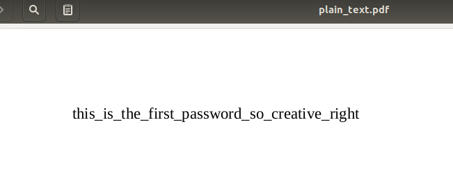
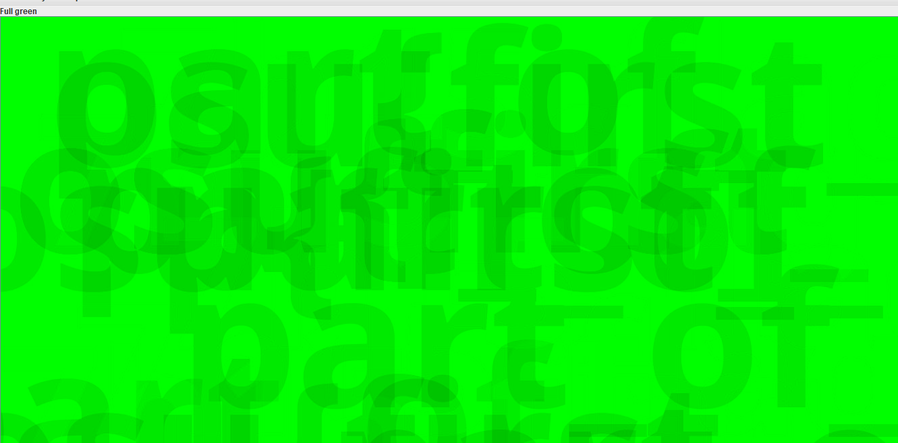
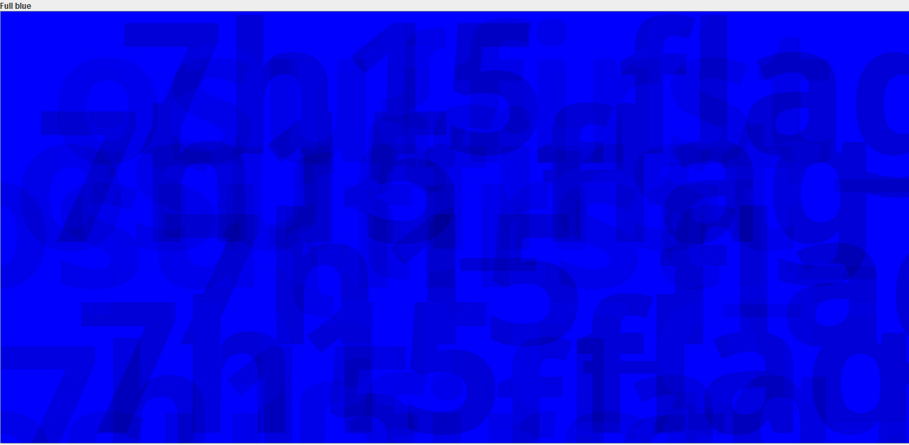

# Russian Nesting Bathhouse
> I recall storing the password as a PDF, and I xored it with a 4-byte repeating key (e.g. ab cd ef 01 ab cd ef 01 ...), but I forgot my key, and I cannot get it back :(.
> Hint: you will not need to brute force this.

This is one of my first introductions to a steganography challenge, and after completing it I can attest that I'm not the biggest fan of them.  But, I still learned a lot about different tools and techniques, so let's jump right into how to solve it!

### Getting the first password

To start, we are given a gzip file that contains two things: A password protected zip file titled `bathhouse.zip`, and a file titled `bathhouse_password`.

If we look back to the challenge description, we are told that they XORED a PDF file with a 4 byte repeating key, so we can assume that `bathhouse_password` is said encrypted file.

So how can we get the orginial PDF back? Well, there is a neat property of XOR, which is that if you XOR the cipher text with the original plain text, you get the key!
```
C = P ^ K
P = C ^ K

K = P ^ C
```

Since the key used is only 4 bytes and repeating, if we are able to know only 4 bytes of the original PDF, we can get our key.  Thankfully, every PDF starts with the *exact* same 4 bytes.  These bytes are known as Magic Bytes, and are what is used by programs to determine the type of file something is.  The magic bytes for a PDF are: `25 50 44 46 2D`, and the first 4 bytes of our encrypted PDF are `D6 DF 47 2F`. So to get the key:

```
P ^ C = K

25 ^ D6 = F3
50 ^ DF = 8F
44 ^ 47 = 03
46 ^ 2F = 69

K = [F3, 8F, 03, 69]
```

Using this, we can now write a small python script to decrypt the file!

```python
plain_text = open("plain_text.pdf", "wb")

f = open('bathhouse_password', 'rb')
cipher_text = f.read()
f.close()

key = [0xf3, 0x8f, 0x03, 0x69]

result = b''
j = 0

for i in range(len(cipher_text)):
    result += bytes([cipher_text[i]^key[j]])
    j = (j + 1) % 4

plain_text.write(result)
```

And running it we get a PDF file with the first password!



### Getting the second password and using it

After using the password to open the zip file, we are greeted with a new file titled `polish_cow.mp3`.  The first thing I did was listen to it, and oh boy does it bop.  But it was just a normal song, nothing special.  I then was going to put it in audacity to look at the spetrogram when I noticed that the album art look interesting:


And would you look at that title! It says:
>Why would someone hide a password in mp3 tags?

Let's check out those tags.  We can run `exiftool` on it to get the file's metadata. After running, we can see we got a password.

```
Channel Mode                    : Stereo
MS Stereo                       : Off
Intensity Stereo                : Off
Copyright Flag                  : False
Original Media                  : False
Emphasis                        : None
ID3 Size                        : 154584
Title                           : Why would someone hide a password in mp3 tags?
Composer                        : p4$$w0Rd
Encoder Settings                : Lavf58.29.100
```

### Getting half of the flag

So the password is `p4$$w0Rd`, but what is the password for?

After doing some research on different steganography tools that involve passwords, I came across a very popular one called `steghide`. Unfortunately, steghide only works on images.  I was actually stuck on this part for a bit before I realized that I could use steghide on the album art!  I just need to extract it first. 

To do this, I used a tool called `foremost`, which can recover files based on their internal data structure.  I ran the command, and got my image!

`foremost -t jpeg -i polish_cow.mp3 -T`

Now to run steghide with the password:

`steghide extract -p 'p4$$w0Rd' -sf picture.jpg -xf out`

And we are able to recover another gzip file.  After uncompressing it, there is a text file that is titled `flag_part_2.txt`, which gives us the second part of our flag!

`_dont_forget_5736h1d3}`

### Getting the other half of the flag

With our image extracted, we can run one more tool on it to try to get the rest of the flag.  The tool I will be using for this is `stegsolve.jar`, which is a tool that can reveal differnt color planes of an image.  The planes that give us the rest of the flag are:

#### `osu{first_`


#### `part_of_`


#### `7h15_flag`


Putting everything together, we get our flag!!!

`osu{first_part_of_7h15_flag_dont_forget_5736h1d3}`
